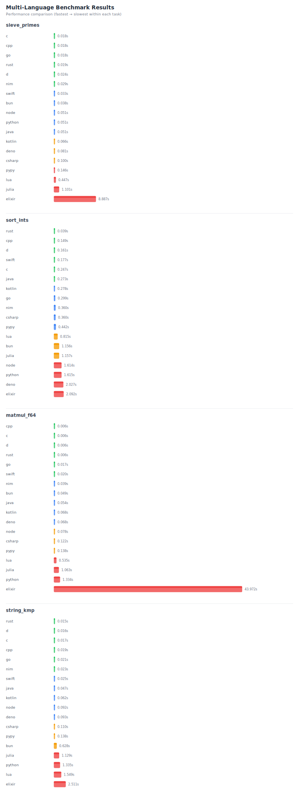

# Multi-language Benchmark Harness — Multi-Test (v1)

This repository contains a small cross-language benchmark suite with four tasks:

- sieve_primes N — count primes ≤ N (simple sieve)
- sort_ints N — generate N uint32 via LCG, sort ascending, output "xor sum_mod"
- matmul_f64 n — naive A·B (n×n) double matrix multiply, output bit-pattern sum(C) as hex64
- string_kmp N M — text of length N ('a'..'z') and pattern of length M from LCG, count total occurrences (KMP)

All programs use the same argument protocol:
<program> <task> [args...]

Output per task:
- sieve_primes: count
- sort_ints: "<xor> <sum_mod>"
- matmul_f64: hex64 bit-pattern of sum(C) (float64)
- string_kmp: count

Included languages: C, C++, Rust, Go, Java, Kotlin, C#, Swift, Node.js, Bun, Python, Zig, D (LDC), Nim, PyPy, Deno, Elixir, Lua, Julia.

## Run (Bun)
This repo now includes a Bun-based harness. To run the full benchmark using Bun:

```bash
# install Bun (https://bun.sh) if you don't have it
bun harness/run_bench.js           # builds (if needed) and runs all tasks
bun harness/plot_results.js        # reads results/summary.json and writes results/summary.svg
```

Alternatively, you can run with Node.js after installing dependencies:

```bash
npm install js-yaml
node harness/run_bench.js          # builds (if needed) and runs all tasks
```

Results are saved to `results/summary.json`, `results/summary.csv` and `results/summary.svg`.

Ordering: within each task the results are shown and plotted from fastest (top) to slowest (bottom).

If you generated the plots, they'll appear below (the file is created at `results/summary.svg`):



## Config
Edit `harness/config.yaml` to change task sizes, runs (warmup/repeat/timeout) and language commands.

## Dependencies

To run all languages locally, you'll need the following installed:

### System packages (Ubuntu/Debian)
```bash
sudo apt-get update
sudo apt-get install build-essential lua5.4 liblua5.4-dev
```

### Language runtimes
- **C/C++**: GCC or Clang (included in build-essential)
- **Rust**: Install via [rustup](https://rustup.rs/) - latest stable
- **Go**: Install from [go.dev](https://go.dev/dl/) - latest stable  
- **Java**: OpenJDK 21+ or Oracle JDK
- **Kotlin**: Install from [JetBrains](https://kotlinlang.org/docs/command-line.html)
- **C#/.NET**: Install [.NET 8+](https://dotnet.microsoft.com/download)
- **Swift**: Install from [swift.org](https://swift.org/download/) - latest stable
- **Node.js**: Install from [nodejs.org](https://nodejs.org/) - latest LTS
- **Bun**: Install from [bun.sh](https://bun.sh/) - latest stable
- **Python**: Python 3.11+ (usually pre-installed)
- **Zig**: Install from [ziglang.org](https://ziglang.org/download/) - latest stable
- **D (LDC)**: Install from [dlang.org](https://dlang.org/download.html) - prefer LDC latest
- **Nim**: Install via [choosenim](https://nim-lang.org/install.html) - latest stable (2.x)
- **PyPy**: Install PyPy3 from [pypy.org](https://pypy.org/download.html) - latest stable
- **Deno**: Install from [deno.land](https://deno.land/#installation) - latest stable (2.x)
- **Elixir**: Install from [elixir-lang.org](https://elixir-lang.org/install.html) with latest OTP
- **Lua**: Lua 5.4 (included in system packages above)
- **Julia**: Install from [julialang.org](https://julialang.org/downloads/) - latest stable (1.10/1.11)

### JavaScript harness dependencies
```bash
npm install js-yaml
```

### JIT Warm-up Notes
Some languages (PyPy, Deno, Elixir/BEAM) benefit from JIT compilation and may show different performance characteristics between cold starts and steady-state execution. The harness includes configurable warmup runs to account for this.

## Fairness
- Build release/optimized and keep `warmup > 0` for JIT/VM languages
- Minimize system noise (close background apps, use performance CPU governor)
- Tests are single-threaded by design

## Extending
Add another task by implementing the handler in each language and adding an entry to `harness/config.yaml`.
