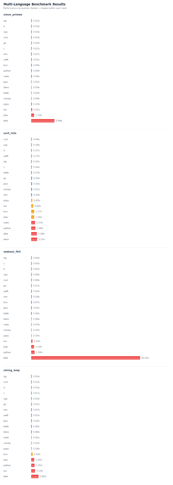

# Multi-language Benchmark Harness — Multi-Test (v1)

This repository contains a small cross-language benchmark suite with four tasks:

- sieve_primes N — count primes ≤ N (simple sieve)
- sort_ints N — generate N uint32 via LCG, sort ascending, output "xor sum_mod"
- matmul_f64 n — naive A·B (n×n) double matrix multiply, output bit-pattern sum(C) as hex64
- string_kmp N M — text of length N ('a'..'z') and pattern of length M from LCG, count total occurrences (KMP)

All programs use the same argument protocol:
<program> <task> [args...]

Output per task:
- sieve_primes: count
- sort_ints: "<xor> <sum_mod>"
- matmul_f64: hex64 bit-pattern of sum(C) (float64)
- string_kmp: count

Included languages: C, C++, Rust, Go, Java, Kotlin, C#, Swift, Node.js, Bun, Python, D (LDC), Nim, PyPy, Deno, Elixir, Lua, Julia.

## Run (Bun)
This repo now includes a Bun-based harness. To run the full benchmark using Bun:

```bash
# install Bun (https://bun.sh) if you don't have it
bun harness/run_bench.js           # builds (if needed) and runs all tasks
bun harness/plot_results.js        # reads results/summary.json and writes results/summary.svg
```

Results are saved to `results/summary.json`, `results/summary.csv` and `results/summary.svg`.

Ordering: within each task the results are shown and plotted from fastest (top) to slowest (bottom).

If you generated the plots, they'll appear below (the file is created at `results/summary.svg`):



## Config
Edit `harness/config.yaml` to change task sizes, runs (warmup/repeat/timeout) and language commands.

## Fairness
- Build release/optimized and keep `warmup > 0` for JIT/VM languages
- Minimize system noise (close background apps, use performance CPU governor)
- Tests are single-threaded by design

## Extending
Add another task by implementing the handler in each language and adding an entry to `harness/config.yaml`.
